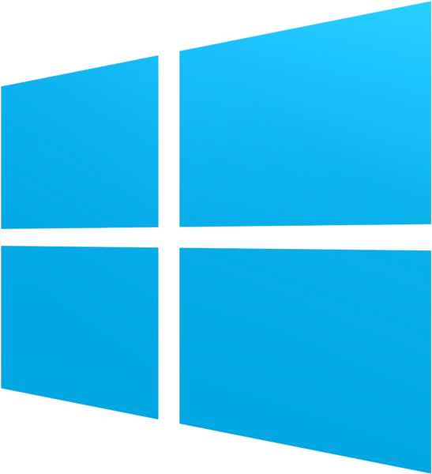

# Welcome to Class!

Below we will guide you into installing the necessary software in order to complete the workshop.

In case of technical difficulties you may encounter: DO NOT DESPAIR!

We can always use an online notebook to run and compile the code.

Instructors: `Ilias Georgakopoulos-Soares izg5139@psu.edu`

Please for any question contact Nikol in the following email: `nmc6088@psu.edu`.

# Installation Guide

