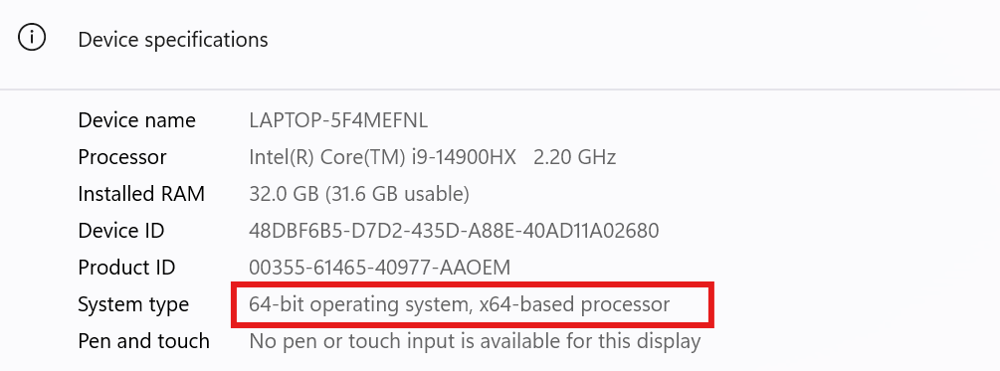
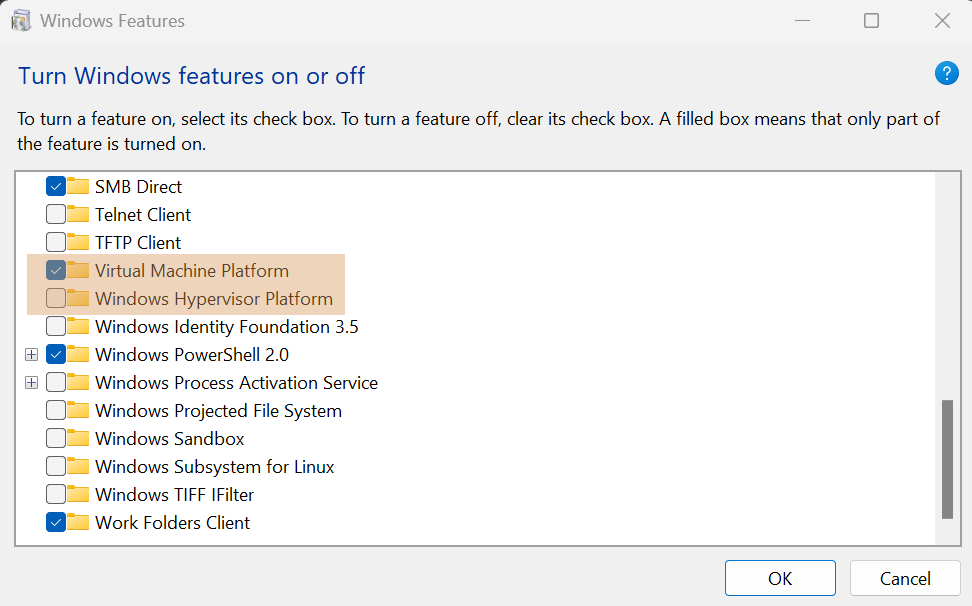
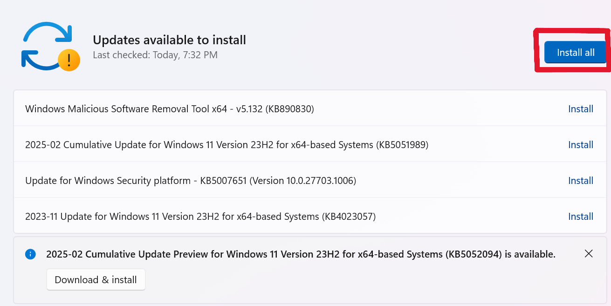

# NON-B DNA Bioinformatics Class: Windows Guide

This is the bioinformatics installation guide for Windows.

Instructors: `Ilias Georgakopoulos-Soares izg5139@psu.edu`

Please for any question contact Nikol in the following email: `nmc6088@psu.edu`.

# WSL Installation

The Windows Subsystem for Linux (WSL) allows us to install a Linux distribution 
(such as Ubuntu, Kali, etc.) and use Linux applications and utilities, Bash command line tools 
directly from Windows.

First, let's check your windows version.

Follow the instructions below to determine your windows version. Why is this important? 
Many important features come out of the box with Windows 11, whereas with Windows 10 we need to struggle more.

- Step 1: Press `Windows + R`
- Step 2: `winver`
- Step 3: `Press Enter`

If you see Windows 10, please contact us.

## System Information

To identify System Architecture proceed as follows:

- Step 1: Press `Win + R`
- Step 2: Type `msinfo32` and press `ENTER`
- Step 3: Open `Settings > System > About` and check your system information.

It should look as follows:



We can see that our system is 64-bit with x64-based Intel processor.

## Virtualization

Before we proceed with WSL installation, we need to make sure virtualization is 
enabled on your computer.

- Step 1: `Windows + R`
- Step 2: Enter: `taskmgr`
- Step 3: Go to the Performance tab.
- Step 4: Click on the CPU tab.

Notice below there's a "Virtualization" field. If it's enabled you can proceed below.

<details>
    <summary> Click Me: Enable Virtualization </summary>
</details>

As a next step, we will make sure virtualization features are enabled. 

- Step 1: `Windows + R`
- Step 2: Enter: `optionalfeatures`
- Step 3: Tick the following fields:
    - Virtual Machine Platform
    - Windows Hypervisor Platform
- Step 4: Close the window and restart your computer.



Make sure you have updated your windows.

- Step 1: `Windows + R`
- Step 2: Enter: `ms-settings:windowsupdate`
- Step 3: Peform the necessary updates.



## WSL Installation

In windows we can execute a command as administrator by using `CTRL + SHIFT + ENTER`
combination. We will execute the 

Follow the instructions below:
- Step 1: Press `Windows + R`
- Step 2: Open powershell, by typing `powershell` and click `CTRL + SHIFT + ENTER` to run as administrator.
- Step 3: Click `YES` to the question: `Do you want to allow this app to make changes to this device?`

The powershell command line will pop up (probably a blue window).

<details>
    <summary> Click me: Windows 10 </summary>

Please leave the previous powershell window open. We will need it!

These steps are specific for Windows 10. We will follow the tutorials here: 

[windows-10-WSL](https://contabo.com/blog/how-to-install-wsl2-on-windows-10/) and the official Microsoft tutorial [microsoft-WSL-old](https://learn.microsoft.com/en-us/windows/wsl/install-manual#step-4---download-the-linux-kernel-update-package).

- Step 1: Enable WSL on your machine.

```
dism.exe /online /enable-feature /featurename:Microsoft-Windows-Subsystem-Linux /all /norestart
```

If everything worked properly, you should see that `The operation completed successfully`.

- Step 2: Enabling Virtual Machine feature

```
dism.exe /online /enable-feature /featurename:VirtualMachinePlatform /all /norestart
```

Again, if everything worked properly, you should see that `The operation completed successfully`.

- Step 3: Download the Linux Kernel Update Package.

The download link: [linux-kernel](https://wslstorestorage.blob.core.windows.net/wslblob/wsl_update_x64.msi)

- Step 4: Set WSL 2 as your default version

Open PowerShell as described above and run this command:

```
wsl --set-default-version 2
```

- Step 5: Install Ubuntu via Microsoft Store

Open Microsoft store from your `Search` bar, search for `Ubuntu` and click on `Get`. Wait until installation has been completed.

It should look like this:


The first time the Linux distribution is launched a new console window will pop-up and you will be asked to wait.

Then you need to create an account after the process is finished.

</details>

<details>

<summary> Click Here: Windows 11 </summary>

Now let's list the available distributions (optional):

```
wsl --list --online
```

We will install Ubuntu distribution as follows:

- Step 1: Enter `wsl --install`
- Step 2: Close the windows and restart your computer.

After restart is complete, we need to perform some sanity checks, to ensure the 
installation has been succesful.

</details>

Check the version of our WSL:

```
wsl -l -v
```

You should see something like:


If the version is not WSL 2, we need to set it as follows:

```
wsl --set-version Ubuntu 2
```

You can open a folder from Ubuntu with Windows Explorer by typing the following command:

```
explorer.exe .
```

The folder will be open using the Windows Explorer.

You can access any directory on your Windows, by accessing the mounted part:

```
cd /mnt/c/Users/<your-username>
```


## Ubuntu Profile

After we have succesfully installed WSL and Windows Terminal, the first time we open WSL, we will have to create a useraccount.

- Step 1: Choose your username.
- Step 2: Choose your password and confirm it.


## Windows Terminal

Let's set your windows terminal as the default:

- Step 1: Type `Windows + R`
- Step 2: Enter `wt`
- Step 3: Press `CTRL + ,`
- Step 4: Change the default profile to Ubuntu
- Step 5: SAVE!


## Locale

Locales customize programs to your language and country. The basic functionality 
is provided by the locales package, which is installed by default with a given 
distribution (source: [Locale](https://help.ubuntu.com/community/Locale)).

Set the locale to english. Type:

```
locale
```

and 

```
sudo locale-gen en_US.UTF-8
```

## CLI tools

We need to install some basic utilities to facilitate our workflow.

Let's run

```
sudo apt update 
sudo apt install -y tree wget curl git imagemagick jq unzip vim 
```

In bioinformatics, most of the time we need to use publicaly available open source 
tools, developed by resources around the world. In order to do that, there are version management
platforms like gitland, github, codeberg and others, that allow us to store 
the source code and the packages on the cloud, in a way that is accessible to all the 
researchers.

In this class we will use github. To communicate with github from the terminal, we need to install
the github command line interface.

Installation instructions can be found in the following link:

[GitHub](https://cli.github.com/)

In particular, linux installation instructions can be found here:


```
(type -p wget >/dev/null || (sudo apt update && sudo apt-get install wget -y)) \
	&& sudo mkdir -p -m 755 /etc/apt/keyrings \
        && out=$(mktemp) && wget -nv -O$out https://cli.github.com/packages/githubcli-archive-keyring.gpg \
        && cat $out | sudo tee /etc/apt/keyrings/githubcli-archive-keyring.gpg > /dev/null \
	&& sudo chmod go+r /etc/apt/keyrings/githubcli-archive-keyring.gpg \
	&& echo "deb [arch=$(dpkg --print-architecture) signed-by=/etc/apt/keyrings/githubcli-archive-keyring.gpg] https://cli.github.com/packages stable main" | sudo tee /etc/apt/sources.list.d/github-cli.list > /dev/null \
	&& sudo apt update \
	&& sudo apt install gh -y
```

and upgrade by running

```
sudo apt update
sudo apt install gh
```

After each section, we need to test that installation was succesful. 

By typing

```
gh --version
```

if we see an error, we need to stop before proceeding. If the version of the gh 
appears correctly we can proceed!


As a next step, we need to setup github CLI. Type:

```
gh auth login -s 'user:email' -w
```

Use `SSH` protocol.

Then copy-paste the code to authenticate via GitHub Web-Page.

Finally, let's check if installation was succesful:

```
gh auth status
```

## Micromamba Installation

In order to utilize the power of programming, best practice is to handle our python versions via a package manager.

In this class, we will use micromamba. Below we will do a step-by-step installation of micromamba and python.

We will follow the instructions present on the following page:

[micromamba](https://mamba.readthedocs.io/en/latest/installation/micromamba-installation.html)

Let's download micromamba using

```
curl -Ls https://micro.mamba.pm/api/micromamba/linux-64/latest | tar -xvj bin/micromamba
```

and

```
eval "$(./bin/micromamba shell hook -s posix)"
```

```
# Linux/bash:
./bin/micromamba shell init -s bash -r ~/micromamba  # this writes to your .bashrc file
# sourcing the bashrc file incorporates the changes into the running session.
# better yet, restart your terminal!
source ~/.bashrc
```

After the installation is complete, verify that it was succesful:

```
micromamba --version
```

Now let's create a virtual environment:

```
export CLASS="nonbdna"
micromamba create -n $CLASS python=3.12
```

You have to click Y[Yes] when prompted.

Now let's activate our environment by running:


```
micromamba activate nonbdna
```

Let's verify that python has succesfully been installed by typing:

```
python --version
```

If you see Python written on your terminal, it means the installation 
was succesful!

Micromamba commands

- Remove environment: `micromamba env remove -n <env_name>`
- List environments: `micromamba env list`
- Deactivate: `micromamba deactivate`
- Create environment: `micromamba create -n <env_name>`
- Create environment with dependencies: `micromamba create -n <env_name> -f environment.yaml`
- Info: `micromamba info`


## GitHub Profile

You need to create a github profile in the following website:

[GitHub](https://github.com/)


After your github profile has been created, we need to create an SSH key to 
be able to access it from the command line
